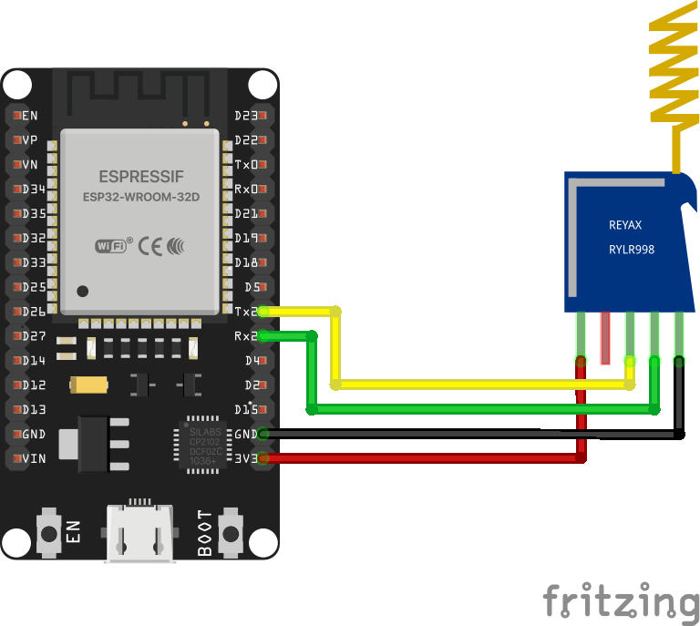
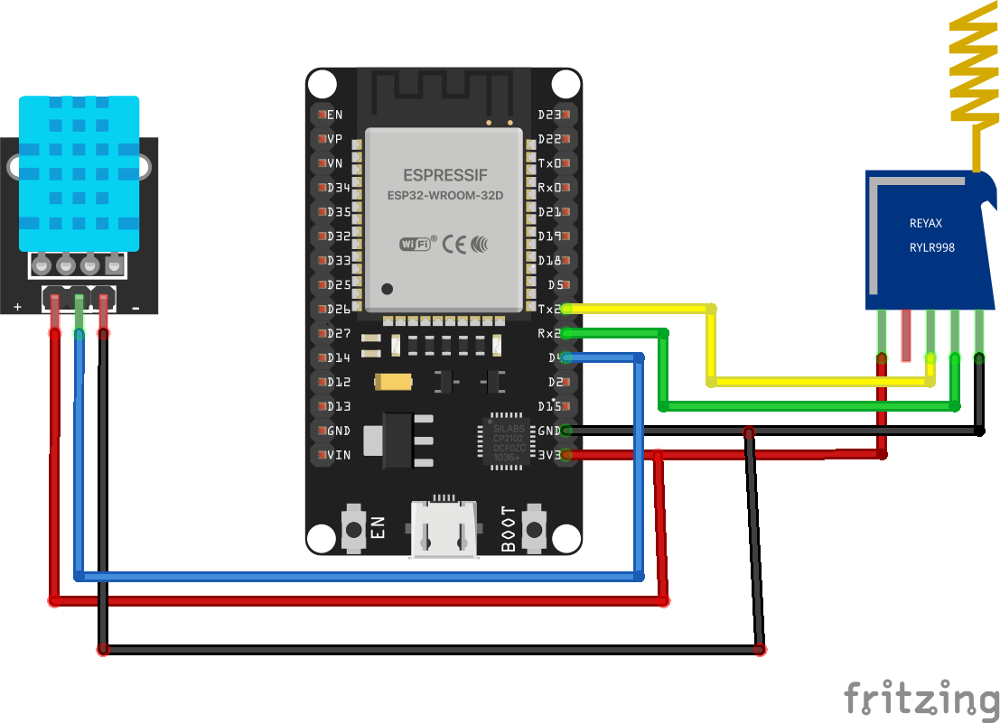
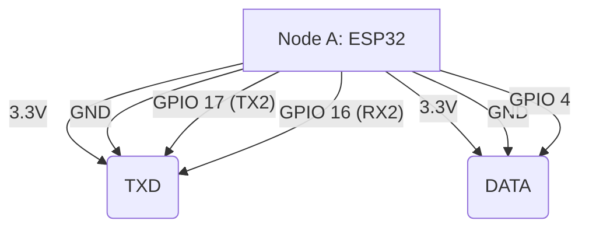
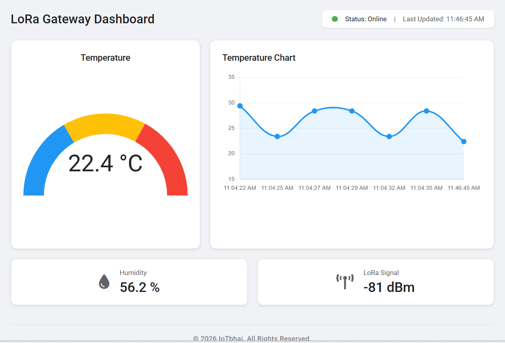

# Build a DIY ESP32 LoRa Gateway to MQTT & Flask | RYLR998 & DHT11

   

This repository contains the complete source code for building a **Custom LoRa to Wi-Fi Gateway**. 

Featured on the **IoTbhai** YouTube channel, this project bridges long-range, offline radio technology (LoRa) with modern web-based IoT dashboards. 

* **Node A (The Field Sensor):** Reads temperature and humidity from a DHT22, formats it into JSON, and transmits it miles away using the Reyax RYLR998.
* **Node B (The Gateway):** Receives the LoRa payload, extracts the Signal Strength (RSSI), and pushes the complete JSON data to an MQTT broker over Wi-Fi.
* **The Dashboard:** A beautiful, dark-mode/light-mode Material Design web dashboard built with Python, Flask, and WebSockets that updates in real-time without refreshing!

## 📺 Watch the Tutorial
*[Link to your YouTube Video will go here]*

## 🛠 Hardware Required
* **2x** ESP32 Development Boards (DOIT DevKit V1 or similar)
* **2x** Reyax RYLR998 LoRa Modules ([Product Link](https://reyax.com//products/RYLR998))
* **1x** DHT22 Temperature & Humidity Sensor
* **Jumper Wires** * **Power Source** (Power bank for Node A in the field)

## 🔌 Circuit Diagram & Wiring

To make things easy, **the RYLR998 wiring is exactly the same as our P2P tutorial!** You only need to add the DHT22 sensor to Node A. 

### Both Nodes (RYLR998 Wiring)
| RYLR998 Pin | ESP32 Pin | Function |
|-------------|-----------|----------|
| **VDD** | 3.3V      | Power    |
| **GND** | GND       | Ground   |
| **TX** | GPIO 16   | RX2      |
| **RX** | GPIO 17   | TX2      |


### Node A ONLY (DHT22 Wiring)
| DHT22 Pin | ESP32 Pin | Function |
|-----------|-----------|----------|
| **VCC** | 3.3V      | Power    |
| **GND** | GND       | Ground   |
| **DATA** | GPIO 4    | Sensor Data |


> **Note:** Ensure your antennas are firmly connected to the RYLR998 modules before powering them on to avoid damaging the RF chips.


### Wiring Schematic (Mermaid)



## 💻 How to Use the Code
This project is split into three parts: The Transmitter (C++), the Gateway (C++), and the Dashboard (Python).

### Flash the ESP32s
* Open the Arduino IDE.
* Install the DHT sensor library by Adafruit and the PubSubClient library via the Library Manager.
* Open `Node_A_Transmitter.ino`, verify the DHT pin (GPIO 4), and upload it to your first ESP32.
* Open `Node_B_Gateway.ino`. Update your Wi-Fi SSID and Password at the top of the file, then upload it to your second ESP32.

### Run the Web Dashboard
* You will need Python installed on your computer.
* Open your computer's terminal or command prompt.
* Install the required Python libraries by running:
`pip install Flask Flask-SocketIO paho-mqtt`

* Navigate to the folder `Web_Dashboard` containing `app.py` and the `templates` folder.
* Run the server:
`python app.py`
* Open your web browser and go to http://127.0.0.1:5000.

### Interpreting the Output
As soon as Node A is powered on, it will broadcast JSON via LoRa.
Open the Serial Monitor on Node B (The Gateway), and you will see it process the data and bridge it to Wi-Fi:
```text
Raw LoRa Received: +RCV=0,31,{"temp":28.4,"humidity":55.2},-85,40
Published to MQTT: {"temp":28.4,"humidity":55.2,"rssi":-85}
```
Instantly, your Flask dashboard will catch the MQTT message, flash green, and update the charts in real-time!

